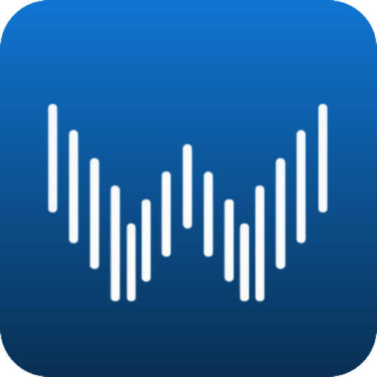

<p align="center">
  
</p>

<h1 align="center">DashScribe</h1>

<p align="center">
  <strong>Talk. It types. Instantly.</strong><br>
  Local, offline dictation for macOS — faster than you can switch tabs.
</p>

<p align="center">
  <a href="#getting-started">Get Started</a> &bull;
  <a href="#features">Features</a> &bull;
  <a href="#how-it-works">How It Works</a> &bull;
  <a href="#contributing">Contributing</a>
</p>

<p align="center">
  
  
  
  
</p>

---

<!-- TODO: Replace with a screen recording GIF showing hold-to-talk → text appearing -->
<!-- <p align="center">
  
</p> -->

## Why DashScribe?

You're on a Zoom call. You need to type a response in Slack. You hold a key, say what you're thinking, release — and the text appears in the Slack message box. No tab switching, no cloud upload, no subscription.

**0.34s average latency.** From the moment you stop talking to text appearing in your active app. On an M4 Pro, a 30-second recording transcribes in ~0.28s. A full 60-second dictation in ~0.2s (the VAD pipeline transcribes segments while you're still talking).

Every word is processed on your Mac. Nothing leaves your machine — ever.

### How it compares

| | DashScribe | macOS Dictation | Wispr Flow | Whisper.cpp |
|---|:---:|:---:|:---:|:---:|
| Fully offline | Yes | No | No | Yes |
| No account required | Yes | Apple ID | Account | Yes |
| Auto-insert into active app | Yes | Yes | Yes | No |
| AI text cleanup (fillers, formatting) | Yes | No | Yes | No |
| Meeting transcription | Yes | No | No | No |
| Lecture recording | Yes | No | No | No |
| App-aware formatting | Yes | No | Yes | No |
| Open source | Yes | No | No | Yes |
| Price | Free | Free | $10/mo | Free |

---

## Features

### Core Dictation
- **Hold-to-talk** — hold your hotkey to record, release to transcribe. Or double-tap to toggle.
- **Global hotkey** — works from any app, any Space, even fullscreen. Right Option by default, fully customizable.
- **Auto-insert** — text pastes directly into the active field without touching your system clipboard.
- **Re-paste** — re-insert your last transcription anytime with Cmd+Option+V.
- **File transcription** — drop in audio files (WAV, MP3, M4A, FLAC, OGG) for batch transcription.

### AI Features (Optional)
- **Smart Cleanup** — removes filler words (um, uh, like, you know) while keeping your natural voice.
- **Context Formatting** — detects which app you're in and adapts: casual for Slack, professional for Mail, verbatim for VS Code.
- **Snippets** — voice-triggered text expansion ("my calendar link" becomes your actual URL).
- **Personal Dictionary** — teach Whisper your names, jargon, and technical terms.

AI features use a local 4B-parameter LLM (~2.9 GB). DashScribe asks before downloading. Everything stays on-device.

### ClassNote
Record lectures, talks, or presentations with live transcription. Segments appear in real-time as the speaker pauses. Review later with audio playback synced to text. Organize with labels and full-text search.

### Meeting Transcription
Capture audio from Zoom, Teams, Meet, or any app — with speaker labels.
- **Listen mode** — system audio only (what others are saying)
- **Full mode** — system + mic, with "You" vs "Others" labels
- Real-time echo cancellation so your mic doesn't double-capture speaker output

### Privacy
- **No cloud.** No servers, no uploads, no analytics, no tracking.
- **No accounts.** Everything stored locally at `~/.dashscribe/`.
- **No telemetry.** Zero. We don't even have a server to send it to.
- **Export/import.** Move settings between machines with a JSON file.

---

## Performance

Measured on MacBook Pro M4 Pro (24 GB), Whisper large-v3-turbo:

| Recording length | Transcription latency |
|:---:|:---:|
| < 5 seconds | ~0.4s |
| 15-30 seconds | ~0.3s |
| 60+ seconds | ~0.2s |

Longer recordings are *faster* because the VAD pipeline transcribes segments while you're still speaking — by the time you stop, most of the work is already done.

**Memory usage:**
| Component | RAM |
|:---:|:---:|
| Whisper large-v3-turbo | ~1.6 GB |
| Qwen3.5-4B (AI features) | ~2.9 GB |
| App + Python + FastAPI | ~0.3 GB |

16 GB Mac: comfortable. 8 GB Mac: works without AI features.

---

## Getting Started

### Requirements
- macOS with Apple Silicon (M1 or later)
- Python 3.11+

### Install from source

```bash
git clone https://github.com/ranabirbasu12/DashScribe.git
cd DashScribe
python3 -m venv venv
source venv/bin/activate
pip install -r requirements.txt
python3 main.py
```

On first launch, the Whisper model (~1.5 GB) downloads automatically.

### Build the .app bundle

```bash
./build_app.sh
cp -R dist/DashScribe.app /Applications/
```

### macOS Permissions

On first launch, macOS will prompt for:

| Permission | Why |
|---|---|
| **Accessibility** | Global hotkey needs to intercept keys system-wide |
| **Microphone** | Recording your voice |
| **Screen & System Audio** | Meeting transcription + echo cancellation |

---

## How It Works

```
You speak into your Mac
       |
       v
  AudioRecorder (sounddevice, 16kHz mono)
       |
       v
  SileroVAD (ONNX Runtime)
  Detects speech boundaries, splits at silences
       |
       v
  StreamingPipeline
  Transcribes segments in parallel while you're still talking
       |
       v
  WhisperTranscriber (mlx-whisper large-v3-turbo)
  Raw speech-to-text on Apple Silicon GPU
       |
       v
  LocalLLM (optional, Qwen3.5-4B-4bit)
  Cleans up fillers, formats for target app
       |
       v
  CGEventPost (kCGHIDEventTap)
  Pastes text into your active app
```

The floating bar sits above all windows. The main dashboard is a native PyWebView window backed by a FastAPI server running on localhost.

---

## Project Structure

```
DashScribe/
├── main.py              # Entry point — PyWebView + threaded uvicorn
├── app.py               # FastAPI backend, WebSocket, REST API
├── recorder.py          # Audio capture (sounddevice)
├── transcriber.py       # Whisper inference + anti-hallucination
├── vad.py               # SileroVAD + VADSegmenter
├── pipeline.py          # Streaming VAD + overlapped transcription
├── hotkey.py            # Global hotkey (CGEventTap)
├── llm.py               # Local LLM for text formatting
├── context.py           # App detection + style mapping
├── aec.py               # Echo cancellation (NLMS, batch + streaming)
├── system_audio.py      # ScreenCaptureKit audio capture
├── meeting.py           # Meeting pipeline (dual VAD + speaker labels)
├── meeting_recorder.py  # Dual-stream capture + streaming AEC
├── classnote.py         # Live lecture transcription pipeline
├── config.py            # Settings, key mappings
├── clipboard.py         # Auto-paste via CGEventPost
├── history.py           # Transcription history (SQLite)
├── state.py             # App state manager
├── updater.py           # Auto-update via GitHub Releases
├── static/              # Frontend (HTML/CSS/JS)
├── tests/               # 865 tests
└── setup.py             # py2app build config
```

---

## Tech Stack

| What | How |
|---|---|
| Speech-to-text | [mlx-whisper](https://github.com/ml-explore/mlx-examples) (large-v3-turbo) |
| Text formatting | [mlx-lm](https://github.com/ml-explore/mlx-examples) (Qwen3.5-4B-4bit) |
| Voice detection | [Silero VAD](https://github.com/snakers4/silero-vad) (ONNX Runtime) |
| Echo cancellation | NLMS adaptive filter |
| System audio | ScreenCaptureKit |
| Backend | FastAPI + uvicorn |
| Frontend | Vanilla HTML/CSS/JS |
| Window | PyWebView (NSPanel) |
| Audio | sounddevice (PortAudio) |
| Global hotkey | Quartz CGEventTap |
| Storage | SQLite (WAL mode) |
| Packaging | py2app |

---

## Contributing

Contributions welcome. Before starting work on a large feature, open an issue to discuss.

```bash
# Run tests
python3 -m pytest tests/ -v

# Run with coverage
python3 -m pytest tests/ -v --cov=. --cov-report=term-missing
```

---

## License

**AGPL-3.0** — see [LICENSE](LICENSE).

You're free to use, modify, and distribute DashScribe. If you distribute a modified version, you must release your source code under the same license.

**Commercial licensing:** If you want to use DashScribe in a closed-source product, [contact me](mailto:ranabirbasu12@gmail.com) for a commercial license.

---

<p align="center">
  <sub>Built on Apple Silicon. No cloud required.</sub>
</p>
